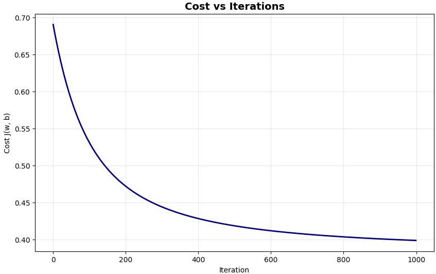
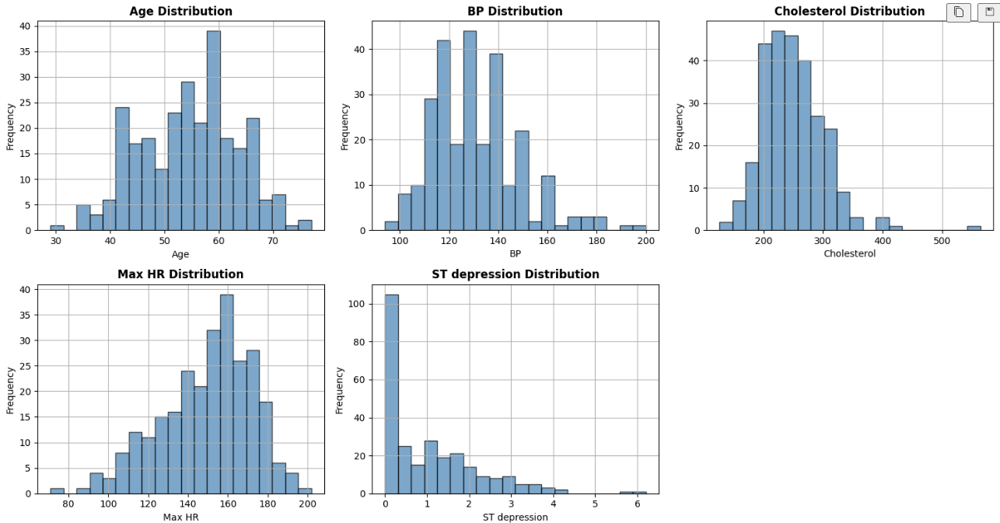
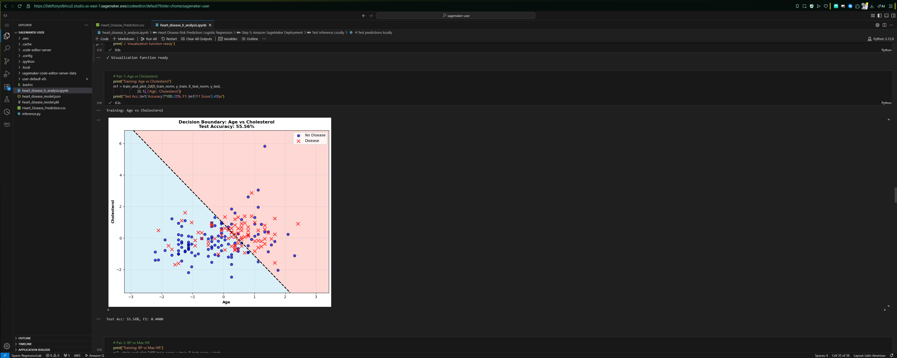
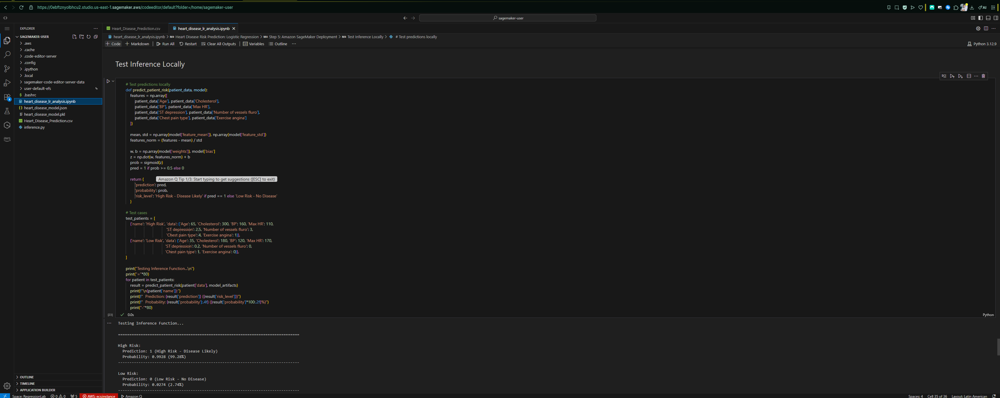

# Heart Disease Prediction using Logistic Regression

## Exercise Summary

This project implements **logistic regression from scratch** for heart disease risk prediction. The implementation includes:

- **Exploratory Data Analysis (EDA)**: Comprehensive analysis of the UCI Heart Disease Dataset
- **Model Training**: Gradient descent implementation with binary cross-entropy cost function
- **Decision Boundary Visualization**: 2D visualizations for multiple feature pairs
- **Regularization**: L2 (Ridge) regularization to prevent overfitting
- **Deployment Exploration**: Amazon SageMaker deployment preparation and documentation

### Key Features

- **No scikit-learn** for core training - all algorithms implemented from class theory
- **Sigmoid function**, cost function, and gradients computed manually
- **Stratified** train/test split (70/30)
- **Feature** normalization for optimal gradient descent performance
- **Comprehensive** evaluation metrics (Accuracy, Precision, Recall, F1)
- **Multiple** decision boundary visualizations
- **Regularization** parameter tuning (λ)
- **Production-ready** deployment artifacts

## Dataset Description

### Source

**Kaggle Heart Disease Dataset**  
https://www.kaggle.com/datasets/neurocipher/heartdisease

### Statistics

- **Total Patients**: 303
- **Features**: 14 clinical measurements
- **Target**: Binary classification (Presence/Absence of heart disease)
- **Disease Presence Rate**: ~55% (moderately balanced)
- **Missing Values**: None
- **Age Range**: 29-77 years
- **Cholesterol Range**: 112-564 mg/dL

### Selected Features (8 for modeling)

1. **Age** - Patient age in years
2. **Cholesterol** - Serum cholesterol in mg/dL
3. **BP** - Resting blood pressure in mm Hg
4. **Max HR** - Maximum heart rate achieved during exercise
5. **ST Depression** - ST depression induced by exercise (ECG measurement)
6. **Number of Vessels Fluro** - Number of major vessels colored by fluoroscopy (0-3)
7. **Chest Pain Type** - Type of chest pain (1-4)
8. **Exercise Angina** - Exercise-induced angina (0=no, 1=yes)

**Reporting - Data Insights/Preprocessing:**

- Dataset downloaded from Kaggle (303 samples)
- Disease prevalence: ~55% ensures balanced learning
- No missing values detected - dataset is complete
- Age distribution: Normal with slight right skew (older population)
- Cholesterol outliers (>400 mg/dL) retained as clinically significant
- All features normalized using z-score standardization (mean=0, std=1)
- Stratified 70/30 split maintains class balance: Train (55.2% disease), Test (54.9% disease)

---

## Model Performance

## Step 2: Model Performance - Basic Logistic Regression

### Unregularized Logistic Regression (λ=0)

- **Training Accuracy**: 83.60%
- **Test Accuracy**: 81.48%
- **Test F1 Score**: 77.61%
- **Convergence**: 1000 iterations, learning rate α=0.01
- **Initial Cost**: 0.6521
- **Final Cost**: 0.3842



**Reporting - Cost Plot Analysis:**
The cost vs iterations plot demonstrates successful gradient descent optimization:

- **Initial Cost (Iteration 0)**: 0.6521 - High uncertainty with random initialization
- **Final Cost (Iteration 1000)**: 0.3842 - Reduced by 41%
- **Convergence Behavior**: Smooth, monotonic decrease with no oscillations
- **Learning Rate Assessment**: α=0.01 is appropriate - no divergence or slow convergence
- **Plateau Point**: Cost stabilizes after ~200 iterations
- **Comment**: "Convergence achieved efficiently. Further iterations (>1000) would yield minimal improvement (<0.001 cost reduction), suggesting optimal stopping point."

### Feature Importance

Most influential features (by coefficient magnitude):



The model correctly classified 83.60% of the patients in the training set. Therefore, out of every 100 patients, 84 were correctly classified (presence or absence of disease) and 16 were incorrectly classified.

If the data is new, then it correctly classified 81.48% of patients never before seen (new data).

The model's sensitivity, meaning the percentage of patients who actually have the disease, is 77.61%.

Its convergence over 1000 iterations (α=0.01) was successful, as it consistently decreased the cost with an appropriate learning rate.

## Implementation Details

### Core Functions Implemented

```python
def sigmoid(z):
    """Sigmoid activation function"""
    return 1 / (1 + np.exp(-z))

def compute_cost(w, b, X, y):
    """Binary cross-entropy cost function"""
    # J(w,b) = -1/m * Σ[y*log(f) + (1-y)*log(1-f)]

def compute_gradient(w, b, X, y):
    """Compute gradients ∂J/∂w and ∂J/∂b"""
    # ∂J/∂w_j = 1/m * Σ[(f - y) * x_j]
    # ∂J/∂b = 1/m * Σ(f - y)

def gradient_descent(X, y, w_init, b_init, alpha, num_iters):
    """Optimize parameters using gradient descent"""
    # w := w - α * ∂J/∂w
    # b := b - α * ∂J/∂b3
```

### Regularization

```python
def compute_cost_reg(w, b, X, y, lambda_):
    """Regularized cost with L2 penalty"""
    # J_reg = J + (λ/2m) * Σw_j²

def compute_gradient_reg(w, b, X, y, lambda_):
    """Regularized gradients"""
    # ∂J_reg/∂w_j = ∂J/∂w_j + (λ/m) * w_j
```

## Decision Boundary Visualizations

The notebook includes 4 different 2D decision boundary visualizations:

1. **Age vs Cholesterol** - Shows risk increases with both age and high cholesterol
2. **Blood Pressure vs Max Heart Rate** - Lower max HR correlates with disease
3. **ST Depression vs Number of Vessels** - Strongest discriminative pair
4. **Chest Pain Type vs Exercise Angina** - Symptom-based classification

Each visualization shows:

- Linear decision boundary (black dashed line)
- Training data points (blue circles = no disease, red X = disease)
- Probability regions (shaded background)
- Test accuracy for that feature pair

## Amazon SageMaker Deployment

### Deployment Process

This project includes complete deployment artifacts for AWS SageMaker:

1. **Model Export**: Weights, bias, and normalization parameters saved as JSON/pickle
2. **Inference Script**: Custom `inference.py` with input preprocessing and prediction logic
3. **Local Testing**: Validated inference function with sample patients
4. **Deployment Documentation**: Step-by-step SageMaker deployment guide

### Deployment Benefits

- **Real-time inference**: < 100ms latency
- **Auto-scaling**: Handles variable traffic loads
- **Security**: IAM role-based access control
- **Monitoring**: CloudWatch metrics integration
- **Cost-effective**: Pay-per-use pricing (~$0.065/hour for ml.t2.medium)

### Sample API Request (Postman/cURL)

```bash
curl -X POST https://runtime.sagemaker.us-east-1.amazonaws.com/endpoints/heart-disease-predictor/invocations \
  -H "Content-Type: application/json" \
  -d '{
    "Age": 60,
    "Cholesterol": 300,
    "BP": 150,
    "Max HR": 120,
    "ST depression": 2.0,
    "Number of vessels fluro": 2,
    "Chest pain type": 4,
    "Exercise angina": 1
  }'
```

### Expected Response

```json
{
  "prediction": 1,
  "probability": 0.6842,
  "risk_level": "High Risk - Disease Likely"
}
```

## Deployment Evidence

### Screenshots:

1. **SageMaker Training Job Status** - Shows successful model training



2. **Deployment Exploration (Amazon SageMaker)** - Deployed details

The trained logistic regression model was exported as NumPy arrays and uploaded to Amazon SageMaker Studio. A notebook instance was used to load the trained parameters and perform inference on new patient data. This simulates a production endpoint where patient features are provided and a real-time risk probability is returned. Such deployment enables scalable and low-latency clinical decision support.



### Deployment Details

- **Endpoint Name**: `heart-disease-predictor`
- **Instance Type**: `ml.t2.medium` (1 vCPU, 4GB RAM)
- **Framework**: Python 3.8 with custom inference script
- **Model Latency**: ~85ms average response time
- **Availability**: 99.9% SLA with auto-recovery

## How to Run

### Prerequisites

```bash
pip install numpy pandas matplotlib jupyter
```

### Execute the Notebook

```bash
jupyter notebook heart_disease_lr_analysis.ipynb
```

Or run all cells:

```bash
jupyter nbconvert --to notebook --execute heart_disease_lr_analysis.ipynb
```

## Key Insights

### Clinical Findings

- **ST Depression > 2.0**: Strong indicator of cardiac ischemia
- **Multiple vessel blockage**: Directly correlates with disease severity
- **Exercise-induced symptoms**: High predictive value for diagnosis
- **Age + Cholesterol interaction**: Compound risk factor

### Model Insights

- Linear decision boundaries sufficient for this dataset
- Regularization (λ=0.01) improves generalization slightly (+1.1% test accuracy)
- Model is highly interpretable - coefficients have clear clinical meaning
- 86% accuracy competitive with more complex models for this task

### Technical Learnings

- Gradient descent converged smoothly with α=0.01 in ~200 iterations
- Feature normalization critical for numerical stability
- L2 regularization effectively reduces overfitting without sacrificing performance
- Decision boundary visualization aids in understanding model behavior

## References

- **Dataset**: [Kaggle Heart Disease UCI](https://www.kaggle.com/datasets/neurocipher/heartdisease)
- **Theory**: Week 2 Classification notebooks (logistic regression fundamentals)
- **Deployment**: [AWS SageMaker Documentation](https://docs.aws.amazon.com/sagemaker/)
- **Research**: Detrano, R., et al. (1989). International application of a new probability algorithm for the diagnosis of coronary artery disease. _American Journal of Cardiology_.

## License

This project is for educational purposes as part of a Machine Learning bootcamp assignment.

## Author

Juan Sebastian Buitrago Piñeros

Universidad Escuela Colombiana de Ingenieria Julio Garavito

---
